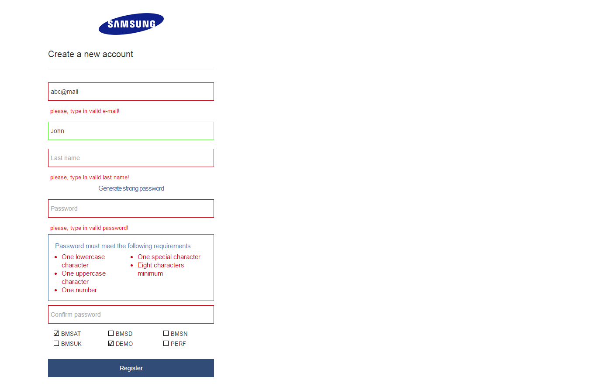
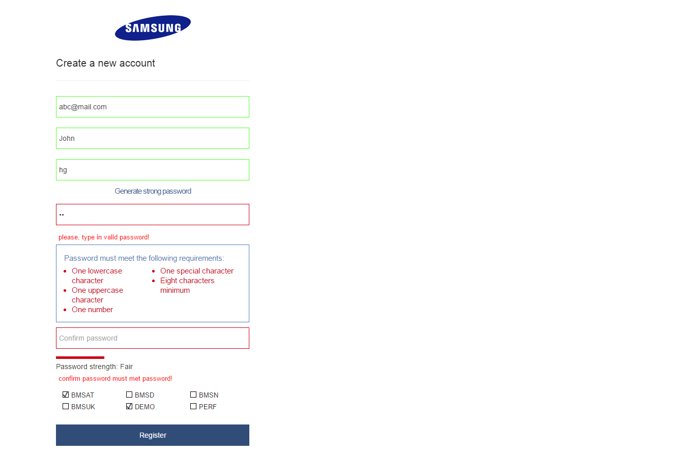
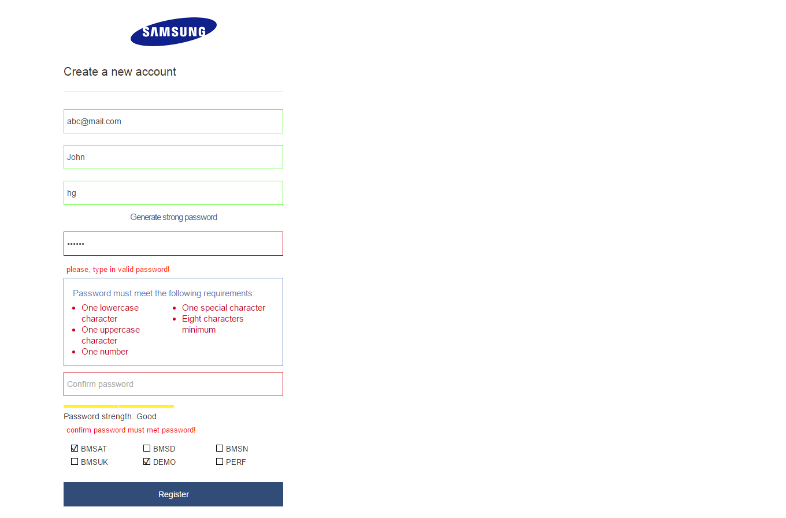
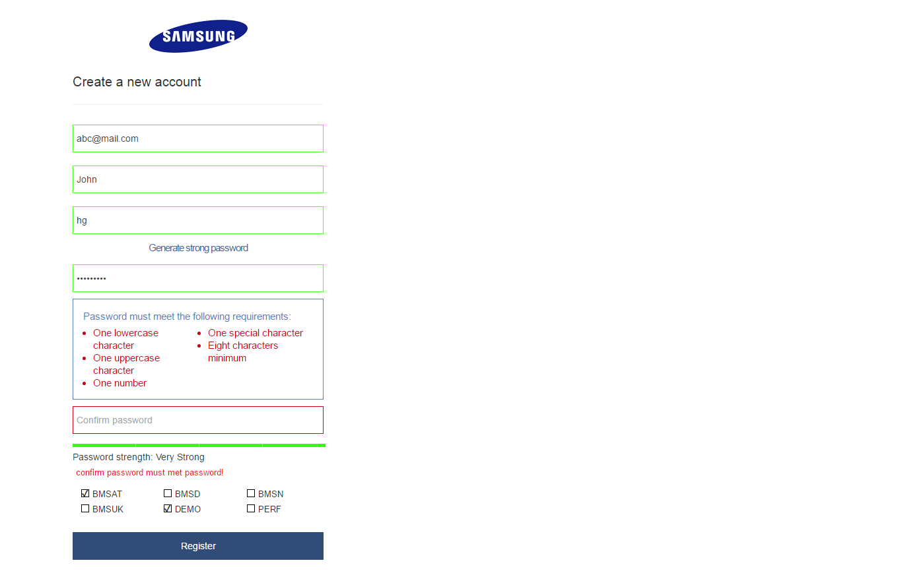
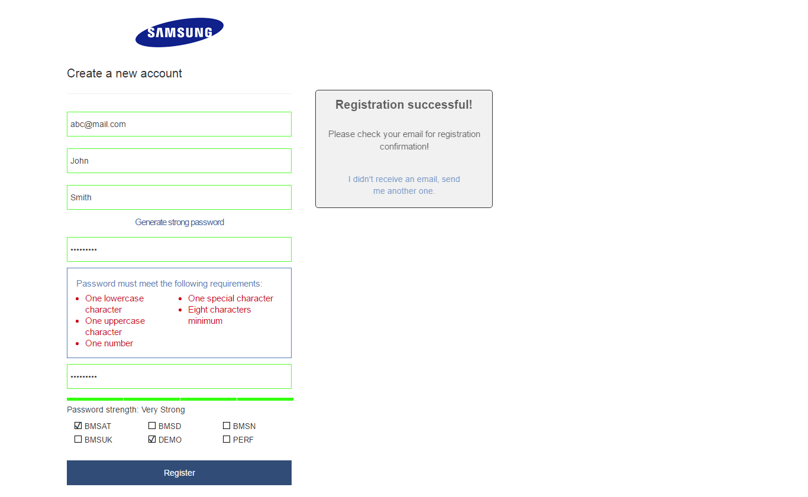

## MediaAccess

This is Media Access responsive mobile friendly form (for customer).

|  Stack  |
|----------|
| Jade   |
| Less  |
| Gulp  |
| Bootstrap3 |
| plain Javascript |

## Features
* Form fields validation; 
* Password validation with real time color strength indicator; 
* Custom checkboxes; 
* Display popup after submitting a form, if all fields validation passed correctly;
* Country checkbox section hidden if URL contains "country" in string.

## Quickstart

    $ git clone https://github.com/Kolom/MediaAccess
    $ cd MediaAccess    
    $ sudo npm install gulp -g && npm install 
    $ npm start 
    $ start localhost:8080/index.html

## Version 1.1

* Form width increased (for better visibility);
* Form centered;
* Used less color function on form input fields borders (for better visibility);
* Outline appears on input field when it gets focus;
* Outline appears on submit button on click;
* Favicon added;
* Logo wrapper added;
* Background image for password input field added.

## Screenshots

